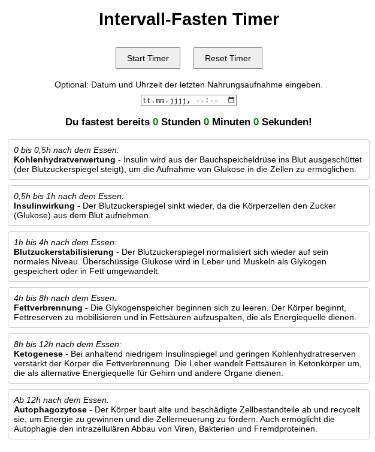

# fasten-timer
A minimal fasting timer running in the browser and installable as a Progressive Web App (PWA). Track your fasting periods, adjust the start time retroactively, and keep your data stored locally. No login, no cloud. A vibe-coding project built with Google Gemini.

## Screenshot

## Credits
- Icons by Freepik / Flaticon
- "Intermittierende Fasten Icons" created by Freepik  
- Source: https://www.flaticon.com/de/kostenlose-icons/intermittierende-fasten
